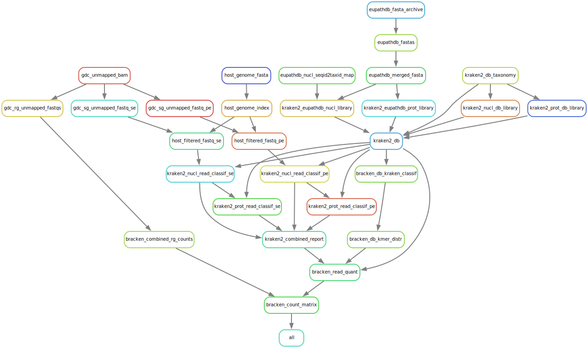

# tcga-wgs-kraken-microbial-quant

A Kraken2 + Bracken based pipeline for classifying and quantifying
microbial reads from GDC TCGA WGS data.

Feature highlights:

- Supports Kraken2 or KrakenUniq for read classification.
- Supports HISAT2 or Bowtie2 for host filtering.
- Automatically builds the latest MicrobialDB nucleotide and protein
  Kraken2 databases (for KrakenUniq nucleotide only). MicrobialDB
  consists of archaea, bacteria, viral, human, UniVec_Core, and
  eukaryotic pathogen genomes (EuPathDBv54) with contaminants removed.
- Includes the (by default enabled) option to do a second pass Kraken2
  protein translated search of the unclassified reads from the Kraken2
  first pass and combining the report results before feeding into Bracken.
- Properly handles TCGA WGS merged BAMs with mixed PE/SE reads and
  multiple read lengths by splitting them into read group level FASTQs
  and processing data through the pipeline at read group level before
  aggregating the Bracken count results back to merged BAM level.

See [References](#references) for the general basis for this pipeline
and more information.

A high-level pipeline summary:

```
1) GDC TCGA WGS Unmapped Read BAMs
2) Biobambam2 Unmapped Read FASTQs (split by read group when BAM has mixed PE/SE or read lengths)
3) HISAT2 (or Bowtie2) Host Filtering (with T2T-CHM13v2.0)
4) Kraken2 (or KrakenUniq) Nucleotide Read Classification (with MicrobialDB)
5) Kraken2 Translated Search Read Classification of Unclassified Reads (with protein MicrobialDB)
6) KrakenTools Combine Nucleotide and Protein Reports
7) Bracken Read Quantification
8) Aggregate Read Group Level Bracken Counts/Abundances
9) Count/Abundance Data Matrix
```

## Workflow



## Prerequisites

The project was developed under GNU Linux and MacOS X and assumes the
use of a Unix command line shell. Both Linux and MacOS provide a
command line shell by default. Other needed tools will be installed
by the instructions below.

## Installation

Install and set up
[Miniforge3](https://github.com/conda-forge/miniforge#download)

Obtain the project source and create a conda environment with the tools
needed to run the project:

```bash
git clone https://github.com/hermidalc/tcga-wgs-kraken-microbial-quant.git
cd tcga-wgs-kraken-microbial-quant
mamba env create -f envs/tcga-wgs-kraken-microbial-quant.yaml
mamba activate tcga-wgs-kraken-microbial-quant
```

Test that the installation is working by doing a dry run (if you don't
have a GDC token yet and wish to test your install do
`GDC_TOKEN='' snakemake --dry-run`). Below are the job statistics you
would see for an analysis of all TCGA WGS primary tumors using Kraken2
with the optional addtional step of Kraken2 protein translated search of
unclassified reads:

```bash
$ snakemake --dry-run
Building DAG of jobs...
Job stats:
job                              count
-----------------------------  -------
all                                  1
bracken_combined_rg_counts          82
bracken_count_matrix                 1
bracken_db_kmer_distr                7
bracken_db_kraken_classif            1
bracken_read_quant               10756
eupathdb_fasta_archive               1
eupathdb_fastas                      2
eupathdb_merged_fasta                2
eupathdb_nucl_seqid2taxid_map        1
gdc_rg_unmapped_fastqs              82
gdc_sg_unmapped_fastq_pe         10735
gdc_sg_unmapped_fastq_se            21
gdc_unmapped_bam                 10838
host_filtered_fastq_pe           10735
host_filtered_fastq_se              21
host_genome_fasta                    1
host_genome_index                    1
kraken2_combined_report          10756
kraken2_db                           2
kraken2_db_taxonomy                  2
kraken2_eupathdb_nucl_library        1
kraken2_eupathdb_prot_library        1
kraken2_nucl_db_library              5
kraken2_nucl_read_classif_pe     10735
kraken2_nucl_read_classif_se        21
kraken2_prot_db_library              4
kraken2_prot_read_classif_pe     10735
kraken2_prot_read_classif_se        21
total                            75571
```

- Note: this Snakemake workflow uses a `checkpoint` because we do not know
ahead of time how many read group level unmapped read FASTQs will be
generated from unmapped read GDC BAMs. So the dry run job stats above do
not reflect these additional jobs determined at runtime and re-evaluation
of the workflow DAG. As of GDC Data Release v40 there were `82` mixed PE/SE
or mixed read length TCGA BAMs resulting in `3,199` additional read group
level FASTQs, a total number of FASTQs processed through the pipeline of
`13,955`, and `94,679` total jobs.

## Execution

Given the compute intensive nature of this pipeline and the large
number of jobs required to execute it we highly recommend running it
on an HPC cluster.

Set your GDC controlled access authentication token in the environment
variable `GDC_TOKEN` or `GDC_TOKEN_FILE`, or the file `~/.gdc_token`
so the pipeline can get the token.

Run the workflow:

```bash
./scripts/run_snakemake.sh
```

Run the workflow on a cluster:

```bash
./scripts/submit_snakemake_slurm.sh --workflow-profile workflow/profiles/biowulf
```

I've provided a SLURM cluster configuration for the NIH HPC cluster,
though it is straightforward to create a Snakemake v8+ cluster config for
your particular needs.

The pipeline is configured to not require much storage, as intermediate
files are flagged as temporary and deleted when they are no longer
needed as the pipeline is running, except for the Kraken2 classification
and Bracken quantification results. If you would like to keep intermediate
files for other uses, specifiy the `--notemp` snakemake option in the
workflow run command above.

## References

1. Lu et al. [Metagenome analysis using the Kraken software suite](
   https://www.ncbi.nlm.nih.gov/pmc/articles/PMC9725748/).
   Nat Protoc. 2022 Dec;17(12):2815-2839. doi: 10.1038/s41596-022-00738-y
2. Ge et al. [Comprehensive analysis of microbial content in whole-genome
   sequencing samples from The Cancer Genome Atlas project](
   https://doi.org/10.1101/2024.05.24.595788). bioRxiv 2024.05.24.595788
